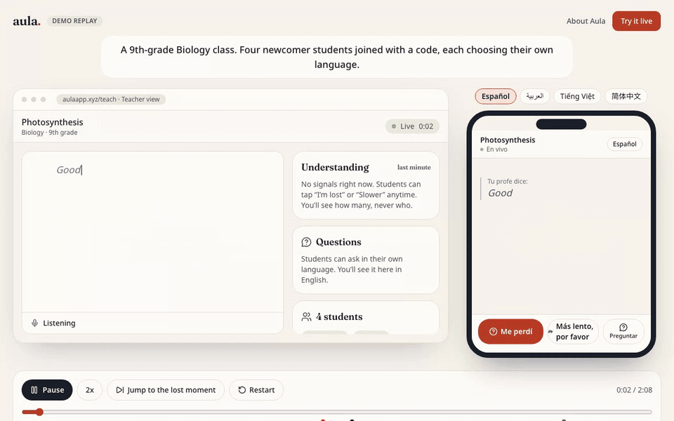
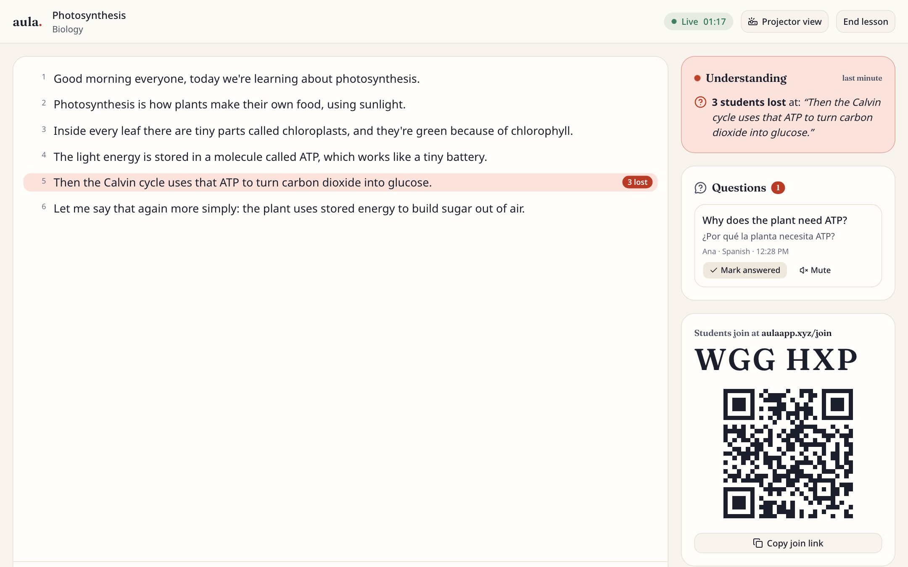
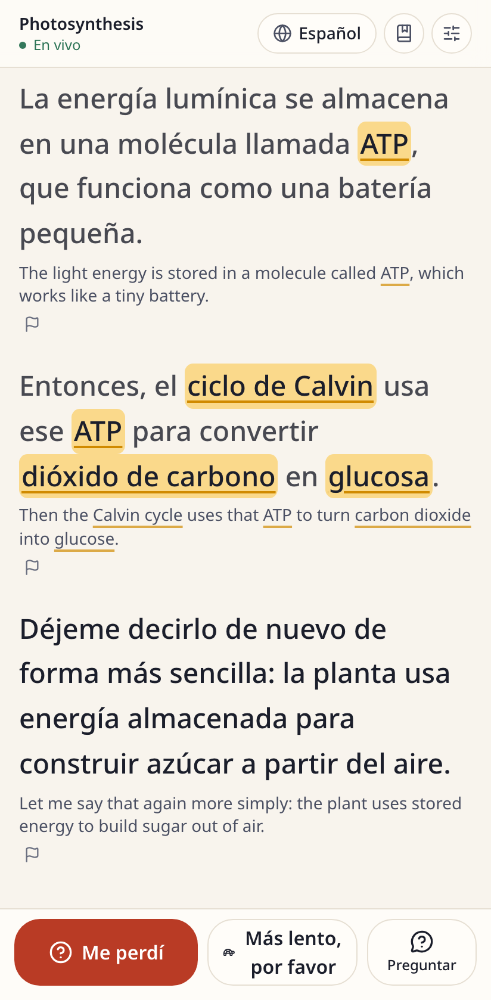
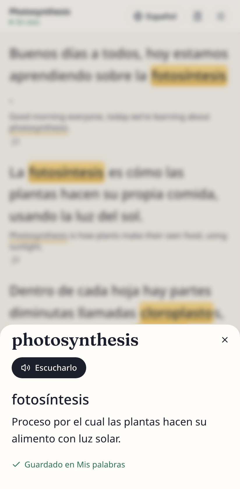
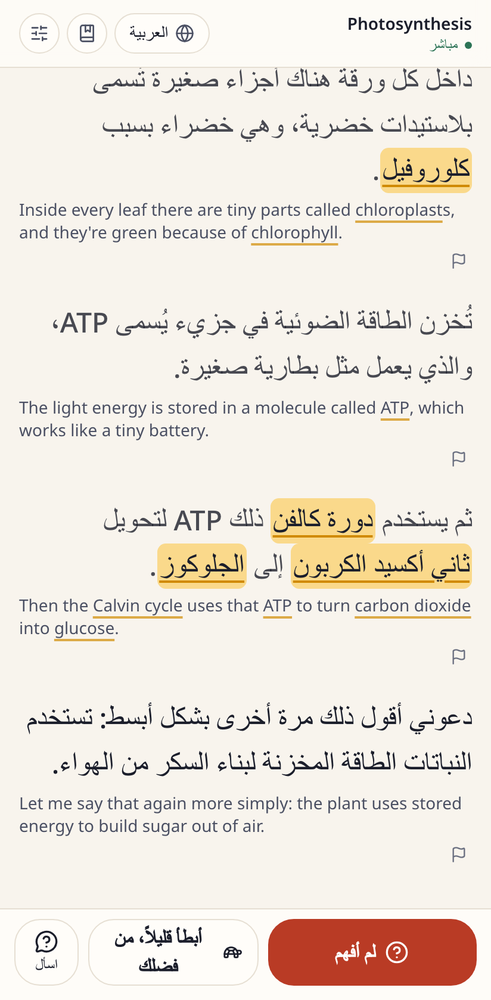
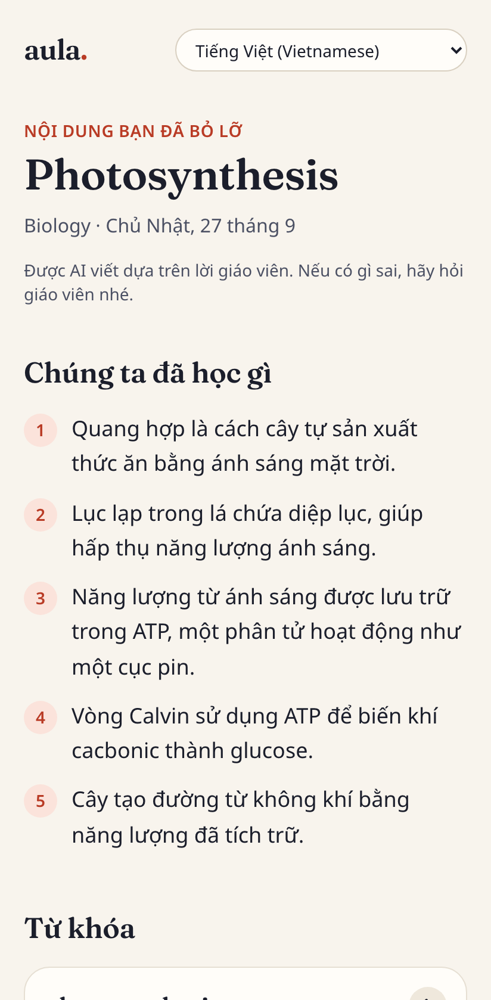
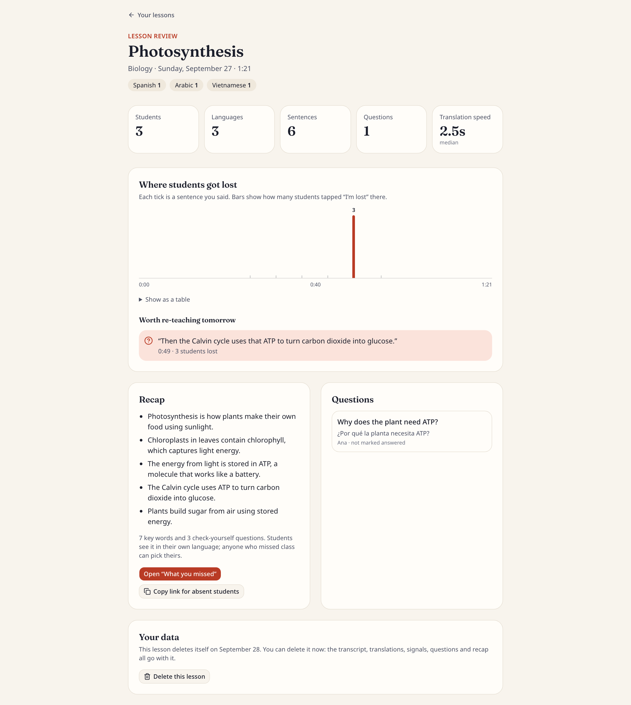
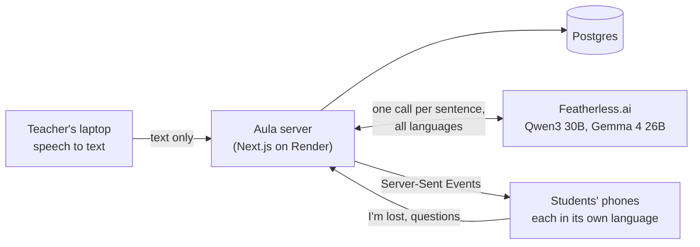

# Aula

**Every lesson, understood, in any language, even if you missed it.**

Aula turns a teacher's voice into live captions in each student's home language, lets lost students signal it silently, and turns every lesson into a recap no one can miss. Free, in the browser, no student accounts.

**Try it:** https://aulaapp.xyz · **Watch a whole lesson in one click:** https://aulaapp.xyz/demo



Made for the CSC Back-to-School Hackathon, 2026.

---

## The problem

- **5.3 million US public school students are English learners,** about 1 in 10 ([NCES](https://nces.ed.gov/programs/coe/indicator/cgf/english-learners)). A newcomer in 9th-grade Biology understands a fraction of what the teacher says, and one classroom often has several home languages.
- **The free tool many teachers used is gone.** Microsoft Translator's multi-device conversations, where a teacher shared a code and every student followed along on their own phone, was retired on June 30, 2026 ([WhistleOut](https://www.whistleout.com/CellPhones/Guides/is-microsoft-translator-worth-downloading)).
- **Translation alone isn't enough.** Students who are lost rarely raise a hand in a language they're still learning. A translation can become a crutch unless it teaches the English words. And about 1 in 5 students is chronically absent ([RAND](https://www.rand.org/pubs/research_reports/RRA956-34.html)); missing a lesson is hardest when you're new to English.

## What Aula does

| | |
|---|---|
| **The teacher just talks.** Open Aula on a laptop, list the lesson's key terms, and show the QR code. |  |
| **Every student reads along in their language,** on their own phone: 13 languages, English underneath, key terms highlighted. Arabic and Dari read right to left. |  |
| **Tap a key word** for a simple definition in your language and its English pronunciation. It's saved to "My words." |  |
| **"I'm lost" is one silent tap.** The teacher sees how many students got lost, and at which sentence, never who. Students can also ask a question in their own language; the teacher reads it in English. |  |
| **When class ends, a recap** in every student's language: summary, key words, check-yourself questions. The same link is the "What you missed" page for absent students. |  |
| **Afterward, the teacher sees where students got lost,** to know what to re-teach tomorrow. |  |

Also: projector mode (big English captions for the room), text size and dark mode for students, a flag button for a wrong translation, and a student interface translated into all 13 languages.

**Languages:** Spanish, Arabic, Chinese (Simplified), Vietnamese, Portuguese, Hindi, Haitian Creole, Ukrainian, Russian, Dari, Somali, Tagalog, French. Haitian Creole, Dari and Somali are marked "beta": AI is weaker in them, and the app says so.

## How to try it

1. **No setup:** click **Watch a live demo** on https://aulaapp.xyz. It plays a real lesson that went through Aula's live pipeline, the teacher's screen and a student's phone side by side, with narration. Switch the phone's language, jump to the moment students got lost, tap a highlighted word. No microphone, login or second device needed.
2. **For real:** click **Try it live**, start a lesson, and scan the QR code with a phone. Talk in Chrome or Safari, or type sentences if you don't want to use the microphone.

If a school or company network blocks aulaapp.xyz (some block domains registered in the last month), the same app is at https://aula-u9nw.onrender.com.

## How it works

The teacher's browser turns speech into text (on the device when Chrome can; otherwise through Google's or Apple's speech service) and sends only the text. The server saves each line, sends the English to every phone instantly, and asks an open AI model on Featherless for the translations: one call per sentence covers every language in the room, streamed back so each language goes out the moment it's ready. Phones stay connected with Server-Sent Events and catch up on anything they miss after a Wi-Fi drop. If the AI fails, students see the English, never a blank line.



The full explanation, with diagrams: [docs/ARCHITECTURE.md](docs/ARCHITECTURE.md).

**Speed:** with real AI, a translated line reaches the phone about 1.5 to 4 seconds after the teacher finishes a sentence; each student's recap summary arrives 15 to 25 seconds after class ends. Measured with `scripts/latency-check.mts`; details in [docs/DECISIONS.md](docs/DECISIONS.md).

## Built with

- **[Featherless.ai](https://featherless.ai)** (sponsor): all AI, with open models. Qwen3 30B for live captions, key-term definitions and the recap; Gemma 4 26B for Somali, Haitian Creole, Dari and Hindi, and for translating the interface once. Chosen by benchmark: [docs/MODEL_BENCHMARK.md](docs/MODEL_BENCHMARK.md).
- **[Render](https://render.com)** (sponsor): one Node web service and Postgres, from a Blueprint (`render.yaml`). Long-lived live connections work there, unlike serverless hosts.
- **[Gen.xyz](https://gen.xyz)** (sponsor): the aulaapp.xyz domain.
- Next.js 16, React, TypeScript, Tailwind CSS, shadcn/ui, Prisma 7 with PostgreSQL 17, Auth.js, zod, the Web Speech API, Vitest, Playwright and axe-core.

## Privacy and safety

- **No audio is recorded or stored.** Only text reaches Aula's server. Speech recognition is done by the browser: on the laptop when Chrome supports it, otherwise by Google's (Chrome) or Apple's (Safari) speech service.
- **Students have no accounts** and don't give real names. Nicknames are shown only to the teacher.
- **The AI never sees names,** only the lesson text, subject and key terms. It's told to translate only, never to answer questions or add content, and the recap is built only from what the teacher said.
- **Questions are visible only to the teacher,** with a light profanity filter and a per-student mute.
- **Lessons delete themselves after 30 days** (24 hours for "Try it live"), and the teacher can delete one at any time, with everything under it.
- Rate limits on every public endpoint, strict security headers, no secrets in the repository.

## Honest limitations

- **AI throughput is shared.** Our Featherless plan processes one request at a time for every classroom, about 33 tokens a second. One or two lessons with a few languages are fast; five languages including Somali, with a teacher who never pauses, lag 10 to 15 seconds. A faster provider would remove this (a configuration change).
- **Translations can be wrong,** especially in the beta languages. The English is always underneath, and students can flag a line.
- **Speech recognition needs Chrome, Edge or Safari** for the teacher. On an iPhone or iPad it needs Dictation turned on. Typing always works.
- **The live event bus runs in one server's memory.** Several servers would need Redis pub/sub.
- **Hackathon hosting:** the free database expires about 30 days after it was created (around Oct 26, 2026) and the Featherless key after about a month. The landing page and Demo Replay don't depend on either.

## Run it locally

```bash
brew install postgresql@17 && brew services start postgresql@17
createdb aula && createdb aula_test
cp .env.example .env.local   # then fill in AUTH_SECRET and AI_API_KEY (a Featherless key)
npm install
npm run db:migrate
npm run dev                  # http://localhost:3000
```

Without an AI key, lessons still work and show English captions with highlighted terms.

| Command | What it does |
|---|---|
| `npm run check` | Lint, type check and 167 unit tests |
| `npm run test:e2e` | Builds the app and runs the 12 browser tests against a mock AI |
| `REAL_AI=1 BASE_URL=http://localhost:3000 npx playwright test e2e/real-ai.spec.ts` | A short lesson with the real AI, with timings |
| `SPEECH=1 npx playwright test e2e/speech.spec.ts e2e/speech-long.spec.ts` | Feeds a synthetic voice into real Chrome as its microphone |
| `npx tsx --env-file=.env.local scripts/latency-check.mts` | Times a realistic lesson end to end |
| `npm run bench` | The model benchmark |

Deploying: [docs/DEPLOY.md](docs/DEPLOY.md).

## What's next

Trying it with real ESL teachers and newcomer students; a faster AI option so large multilingual classes stay under 3 seconds; emailing the recap to families with an n8n workflow; keeping each student's vocabulary across lessons; more languages.

## More

- [docs/ARCHITECTURE.md](docs/ARCHITECTURE.md): how it works, with diagrams
- [docs/DECISIONS.md](docs/DECISIONS.md): every design decision and the measurements behind it
- [docs/MODEL_BENCHMARK.md](docs/MODEL_BENCHMARK.md): how the AI models were chosen
- [docs/EXPLAIN.md](docs/EXPLAIN.md): answers to the questions judges ask
- [docs/AI_USE.md](docs/AI_USE.md): how AI was used to build Aula, and inside it
