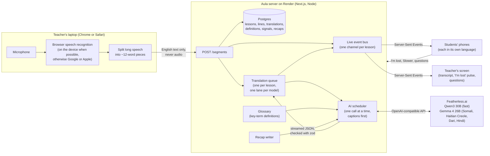
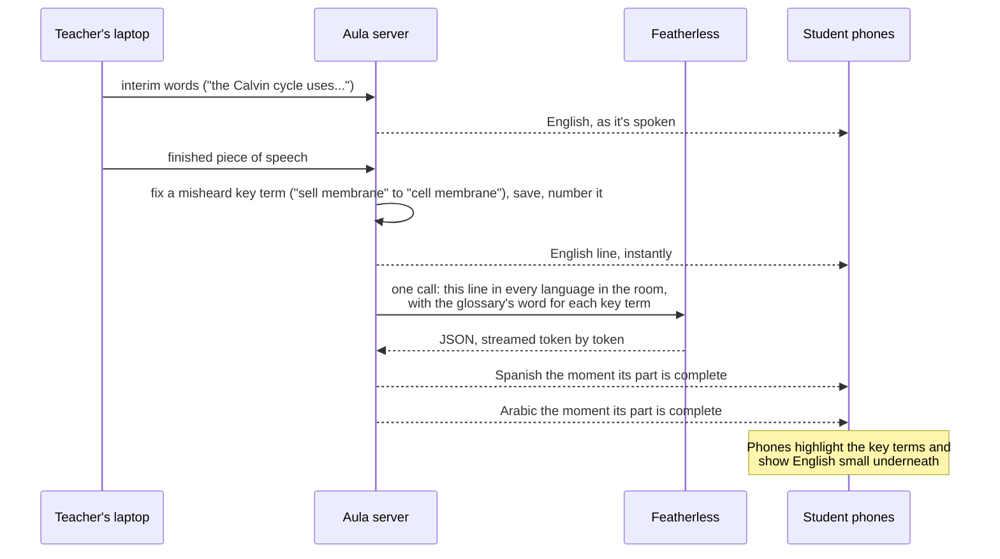
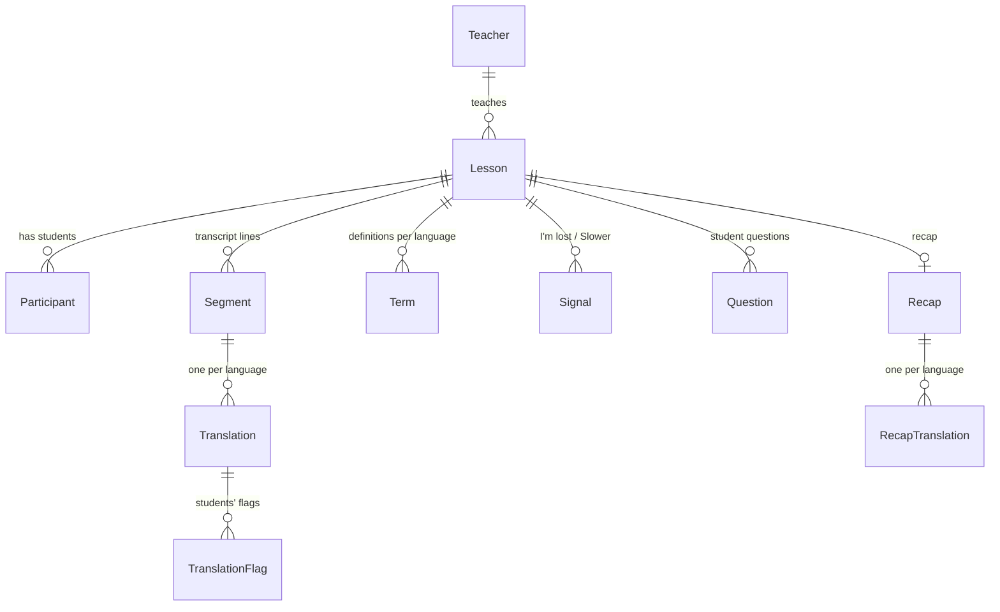

# How Aula works

Aula is one Next.js app running as a long-lived Node server on Render, with a Postgres database. The teacher's laptop turns speech into text, the server translates it with open AI models on Featherless, and every phone in the room gets its own language over a live connection.

## The big picture

## One sentence, start to finish

## The pieces, in plain words

**Speech to text happens on the teacher's laptop.** Aula uses the browser's built-in speech recognition. When Chrome can recognize English on the device itself, it does, and the audio never leaves the laptop. Otherwise Chrome uses Google's speech service and Safari uses Apple's. Aula's server only ever receives text. If the teacher talks without pausing, the laptop sends what it has heard in pieces of about 12 words (breaking before words like "and" or "because") instead of waiting for a pause (`src/lib/chunking.ts`).

**The server numbers every line.** The teacher's browser doesn't pick the order. So a late translation can never scramble the transcript, and a teacher who reloads can't reuse a number.

**One AI call covers every language in the room.** Asking separately for Spanish, then Arabic, then Vietnamese would repeat the same work. Aula asks once and streams the answer back. The reply is JSON, and the moment one language's part is complete, it's checked against a schema (zod) and sent to the students reading that language. Spanish readers don't wait for the Chinese.

**Some languages go to a stronger model.** Qwen3 30B is fast and accurate for Spanish, Arabic, Chinese, Vietnamese and the others. For Somali, Haitian Creole and Dari its output wasn't usable, and for Hindi it needed three times the tokens, so those go to Gemma 4 26B in a separate call. The benchmark behind this is in `docs/MODEL_BENCHMARK.md`.

**Featherless handles one request at a time for our account.** We measured it: four requests sent together finished at 5, 12, 18 and 24 seconds. So Aula has one scheduler for every AI call in every classroom, with priorities: live captions and students' questions first, then recaps and catch-up lines for a student who just joined, then definitions. A background call gets cancelled the moment a caption is waiting, and tries again later.

**Merging keeps a fast talker from building a backlog.** Each lesson has one call in flight. Lines that arrive meanwhile wait, and the next call takes all of them (up to about 11 seconds of reply). If translation falls more than 20 seconds behind, the oldest waiting lines stay in English so captions catch up to what the teacher is saying now.

**Nothing leaves a student with a blank line.** If a call stalls (no reply for 8 seconds), the missing languages get one more try while the line is fresh. If that fails, phones show the English with "Translation not available for this line." A reply that trails off into whitespace is cut short instead of waiting for it.

**Caches.** A sentence already translated into a language (like "Any questions?") comes from an in-memory cache of 2,000 entries. Each language's definitions are written once per lesson, stored in the `Term` table, and reused for highlighting, the tap-to-define sheet, and the live prompt.

**Key terms.** The teacher lists them when starting the lesson. When the first student reading a language joins, Aula writes that language's glossary: the textbook translation and a one-line definition of each term, one term per call so it fits in the pauses between captions. Every live translation is told which glossary word to use, so a term is translated the same way every time and phones can highlight it.

**The live connection.** Each phone holds a Server-Sent Events connection. The server keeps the last 500 events of each lesson, each with an id. A phone that drops off (Wi-Fi blip, locked screen) reconnects with the last id it saw and gets exactly what it missed, or a fresh snapshot of the lesson if it was gone too long. A ping every 15 seconds keeps proxies from closing the connection, and a phone that hears nothing for 40 seconds reconnects by itself.

**"I'm lost" is anonymous and anchored.** A tap records which line the student was reading. The teacher sees how many students (never who) got lost in the last minute, and at which sentence. Each student can tap once every 20 seconds.

**Questions stay human.** A student types in their own language. The AI only translates it into English for the teacher (it's told never to answer). A light profanity filter checks both versions, and the teacher can mute a student.

**The recap.** When the lesson ends, the fast model writes a short summary, key terms with definitions, and three check-yourself questions, from the transcript only. Then every language in the room gets its summary first (a few seconds each), then the terms and questions. The "What you missed" page shows each part as soon as it's ready. Anyone opening the link later can pick any language and it's translated on the spot.

## Data

Everything hangs off the lesson, so deleting a lesson deletes all of it in one step (a test checks this). Students are anonymous `Participant`s: a nickname only the teacher sees, a language, and a random token kept in their browser. Lessons delete themselves after 30 days (24 hours for "Try it live" guest lessons), from an hourly clean-up job inside the server.

## Security

Every response carries a strict content security policy (Aula loads nothing from other sites), HSTS, `nosniff`, a no-framing rule, and a permissions policy that allows only the microphone, only for Aula. Public endpoints are rate limited: joining (20 a minute), signals (1 per 20 seconds), questions (2 per 30 seconds), flags, new recap languages, sign-in and guest lessons. Passwords are hashed with bcrypt. Secrets live only in Render's environment, never in git.

## What would change at scale

Aula runs as one server process, and the live event bus lives in its memory. That's right for a hackathon and a school's worth of classrooms. To run several servers, the bus would move to Redis pub/sub (the interface is small: publish to a lesson, subscribe to a lesson). The bigger limit is AI throughput: one Featherless account processes one request at a time, about 33 tokens a second, for everyone. More classrooms would need more accounts or a faster provider, which is a configuration change because the client speaks the standard OpenAI API.

## Where things live

| Path | What |
|---|---|
| `src/hooks/use-speech-recognition.ts`, `src/lib/chunking.ts` | Speech capture, restarts, microphone choice, splitting long speech |
| `src/app/api/lessons/[id]/` | Segments, interim text, the SSE stream, signals, questions, end, recap, flags |
| `src/lib/realtime/` | The event bus (ring buffer, replay) and SSE helpers |
| `src/lib/pipeline/` | Scheduler, translation queue, glossary, recap, model routing |
| `src/lib/ai/` | Prompts, the streaming client, JSON parsing and zod schemas |
| `src/components/` | Teacher, student, projector, recap, review and Demo Replay screens |
| `src/demo/replay.json` | The recorded lesson behind the Demo Replay |
| `scripts/` | Model benchmark, replay recorder, latency check, UI translation, screenshots |
